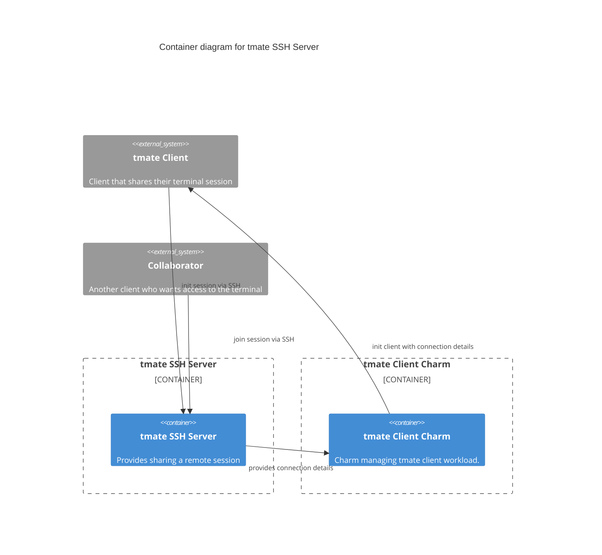

# Charm architecture

The tmate-ssh-server-operator operates [tmate-ssh-server](https://github.com/tmate-io/tmate-ssh-server),
which is the server side of [tmate](https://tmate.io/), an open-source terminal multiplexer
that provides instant terminal sharing capabilities.
The tmate-ssh-server application is built from source as an OCI image and runs as a systemd service on the machine.

The charm provides the necessary connection details for a tmate client to connect to the tmate-ssh-server service
via integration data.





## OCI images

We use [Rockcraft](https://canonical-rockcraft.readthedocs-hosted.com/en/latest/) to build OCI images for tmate-ssh-server. 
The images are defined in [tmate-ssh-server_rock](https://github.com/canonical/tmate-ssh-server-operator/tree/main/tmate-ssh-server_rock).
They are published to the [Github Container registry](https://github.com/canonical/tmate-ssh-server-operator/pkgs/container/tmate-ssh-server).


## Juju events

The following Juju [events](https://juju.is/docs/sdk/event) are observed and handled by the charm as follows:

1. [install](https://canonical-juju.readthedocs-hosted.com/en/latest/user/reference/hook/#install): The charm is installed on the machine. The charm tests if a unit ip is assigned, otherwise the event is deferred. Afterwards,
the charm installs the necessary tmate-ssh-server dependencies, setups ssh keys and installs a systemd service that runs the tmate-ssh-server OCI image. The integration data is updated with the relevant server connection details (equivalent of `tmate.conf` configuration file), 
which can be used by a tmate client to connect to the server.
2. [update-status](https://canonical-juju.readthedocs-hosted.com/en/latest/user/reference/hook/#update-status): This is a regular status check. The charm
checks if the tmate ssh server is still running and restarts it if it is not.
3. `get-server-config-action`: This is an [action event](https://canonical-juju.readthedocs-hosted.com/en/latest/user/reference/hook/#action-actiont)  triggered by the user
to get the current server connection configuration (`tmate.conf`), which can be used by a tmate client to connect to the server.
5. `ssh-debug-relation-joined`: This is a [relation joined event](https://canonical-juju.readthedocs-hosted.com/en/latest/user/reference/hook/#endpoint-relation-joined) that fires when 
a unit joins an integration. It inserts the relevant server connection details into the integration data, which can be used by a tmate client to connect to the server.

> See more about events in the Juju docs: [Hook](https://canonical-juju.readthedocs-hosted.com/en/latest/user/reference/hook)


## Charm code overview

The `src/charm.py` is the default entry point for a charm and has the `TmateSSHServerOperatorCharm` Python class which inherits from CharmBase. CharmBase is the base class 
from which all charms are formed, defined by [Ops](https://juju.is/docs/sdk/ops) (Python framework for developing charms).

> See more in the Juju docs: [Charm](https://canonical-juju.readthedocs-hosted.com/en/latest/user/reference/charm/)

The `__init__` method guarantees that the charm observes all events relevant to its operation and handles them.

Take, for example, when the charm gets deployed.

1. User runs the command:
```bash
juju deploy tmate-ssh-server
```
2. An `install` event is emitted.
3. In the `__init__` method is defined how to handle this event like this:
```python
self.framework.observe(self.on.install, self._on_install)
```
4. The method `_on_install`, for its turn, will take the necessary actions such as installing the tmate-ssh-server software.


The code is structured according to the best practices described in [Managing charm complexity](https://discourse.charmhub.io/t/specification-isd014-managing-charm-complexity/11619).
Therefore, in addition to `src/charm.py`, there are other modules in the charm that are responsible for specific tasks:

- observe changes to the ssh-debug integration
- manage the state of the charm
- abstracting interactions with the tmate-ssh-server application